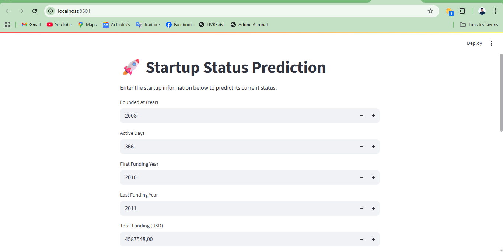
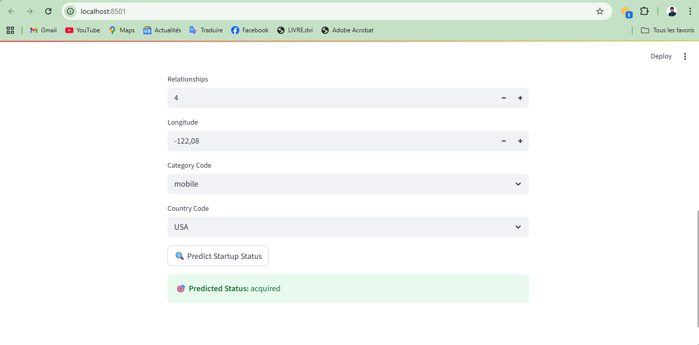

# Topic: Startup Operational Status prediction using Machine learning

# Objective:
The objective of this project is to predict the current status of a startup—whether it is Operating, IPO, Acquired, or Closed. This problem will be addressed using a Supervised Machine Learning approach by training models based on the historical data of startups across all four categories.

# Summary:

The data contains industry trends, investment insights and individual company information. Since the data was acquired on a trial basis, it only contains information about companies. After training the model, we predict whether startups still operating, IPO, acquired, or closed.

   

# Data:

### Link to raw data(Huge JSON and Excel fiel):
        https://drive.google.com/file/d/1tWYkHYHm2HoiCajZ49Cs1K7sklWTdAbV/view

### Data types:

There are 196553 lines and  44 columns out of which will be used as features. The rest provide more information about the data, but will not be used for model training (like normalized name, entity id, short description etc.)

| Column Name           | Description                                                   |
|-----------------------|---------------------------------------------------------------|
| id                    | Unique identifier of the record                               |
| Unnamed: 0.1          | Extra index column (often from CSV import)                    |
| entity_type           | Type of entity (e.g., company, investor)                      |
| entity_id             | Unique ID for the entity                                      |
| parent_id             | ID of parent company/entity                                   |
| name                  | Official name of the entity                                   |
| normalized_name       | Lowercased/cleaned version of the name                        |
| permalink             | URL-friendly version of the name                              |
| category_code         | Industry category code                                        |
| status                | Operational status (e.g., operating, closed)                  |
| founded_at            | Date the entity was founded                                   |
| closed_at             | Date the entity closed, if applicable                         |
| domain                | Website domain                                                |
| homepage_url          | Full homepage URL                                             |
| twitter_username      | Twitter handle of the entity                                  |
| logo_url              | URL of the entity’s logo                                      |
| logo_width            | Width of the logo in pixels                                   |
| logo_height           | Height of the logo in pixels                                  |
| short_description     | Brief summary of the entity                                   |
| description           | Full description                                              |
| overview              | General overview or mission                                   |
| tag_list              | Comma-separated tags                                          |
| country_code          | Country code (e.g., US, FR)                                   |
| state_code            | State code if applicable                                      |
| city                  | City where entity is based                                    |
| region                | Geographic region                                             |
| first_investment_at   | Date of first investment made                                 |
| last_investment_at    | Date of last investment made                                  |
| investment_rounds     | Number of investment rounds participated                      |
| invested_companies    | Number of companies invested in                               |
| first_funding_at      | Date of first funding received                                |
| last_funding_at       | Date of last funding received                                 |
| funding_rounds        | Number of funding rounds received                             |
| funding_total_usd     | Total funding received in USD                                 |
| first_milestone_at    | Date of first milestone achieved                              |
| last_milestone_at     | Date of last milestone achieved                               |
| milestones            | Count or list of milestones                                   |
| relationships         | Relationships with other entities (e.g., founders, partners)  |
| created_by            | User/system who created the record                            |
| created_at            | Timestamp of record creation                                  |
| updated_at            | Timestamp of last update                                      |
| lat                   | Latitude location                                             |
| lng                   | Longitude location                                            |
| ROI                   | Return on Investment                                          |

# Data Preprocessing:

### A. Data Cleaning
    1. Delete irrelevant & redundant information.
    2. Remove noise or unreliable data (missing values and outliers).

### B. Date variables Transformation
    1. Changes in original variables
    2. Create new variables from original variables

### C. Remaining missing values handling

# Exploratory Data Analysis:

### A. Univariate Analysis
    1. Numerical features
    2. Categorical features

### B. Bivariate Analysis
    1. Numerical-Numerical relationships
    2. Categorical-Categorical relationships
    3. Categorical-Numerical relationships

### C. Multivariate Analysis

# Feature Engineering

### A. Feature selection
    1. Numerical features
    2. Categorical features

### B. Log transformation and standardisation
    1. Log transformation
    2. Standardisation

### C. Creation of new features

### D. Feature encoding
    1. Target
    2. Categorical features

### E. Feature engineering Documentation

# Modelling

## Binary Classification:

### A. Binary labeling

### B. Oversampling and spliting

### C. Training models and Results
    1. Logistic Regression 
    2. Naive Bayes

## Multiclass Classification:

### A. Oversampling and spliting
### B. Training models and Results
    1. AdaBoostClassifier
    2. GradientBoostingClassifier
